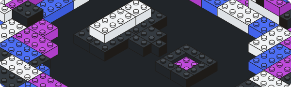

<p align="center">
  
</p>

<h1 align="center">
  Preshape
</h1>

<h3 align="center">
  A minimal design system and library of React components to facilitate my own projects, you probably don't want to use it.<br/>
  <a>https://preshape.hogg.io</a>
</h3>

<hr />

### Getting Started

##### Install with your favourite package manager

```
yarn add preshape
```

### Documentation

Description of the design system and component documentation can be found on the [Preshape site](https://preshape.hogg.io).

### Technology

- [Typescript](https://www.typescriptlang.org/)
- [Parcel](https://parceljs.org/) (bundler and dev servers)
- [React](https://reactjs.org/)
- [PostCSS](https://postcss.org/) (with postcss-preset-env for a little power)
- [Firebase](https://firebase.google.com/) (hosting)

### Setup

##### Prerequisites

• [Node](https://nodejs.org/en/) - Either use [nvm use](https://github.com/nvm-sh/nvm) or checkout the tested version inside the [.nvmrc](./nmvrc) file.

##### Setup

Clone the repository

```
git clone git@github.com:HHogg/circles.git
```

Install the dependencies with your favourite package manager

```
yarn install
```

##### Development

Spin up the Parcel development server

```
yarn start
```

### Contribution

Preshape uses a strict commit message structure that follows the [Conventional Commits](https://www.conventionalcommits.org/en/v1.0.0-beta.4/) spec. This is used to automate publishing the package to NPM and generating the changelog with [Semantic Release](https://github.com/semantic-release/semantic-release).


